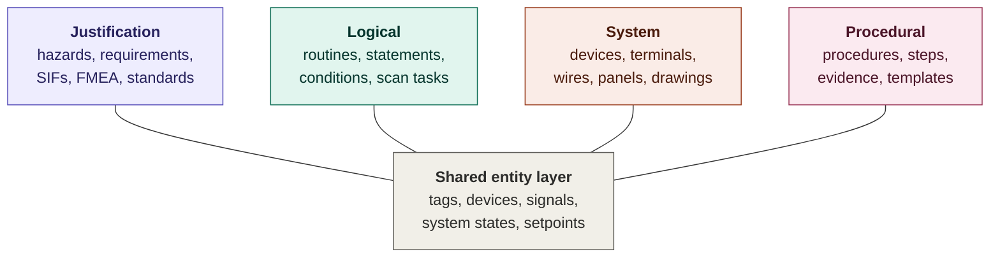
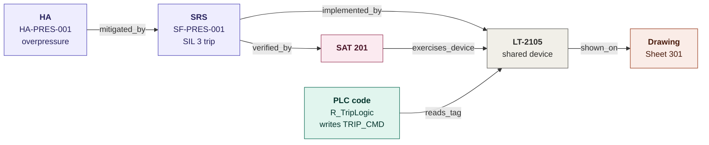
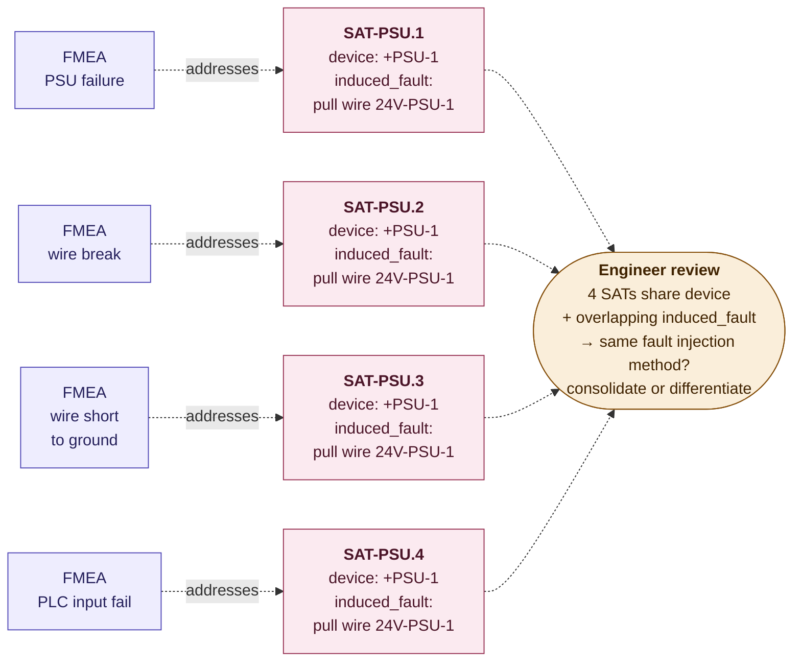
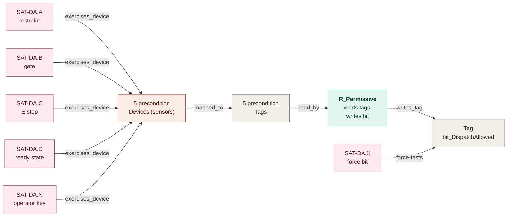
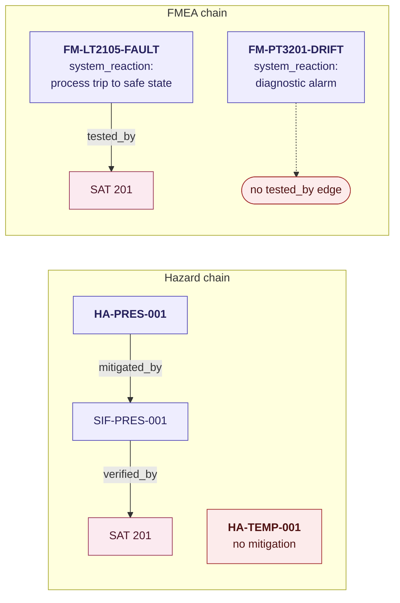
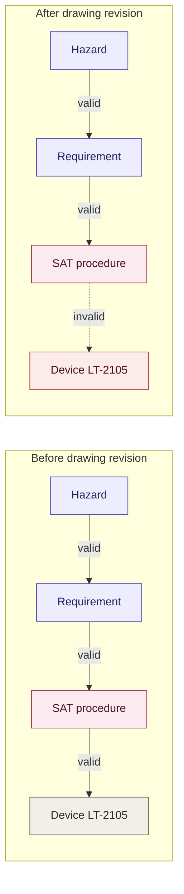
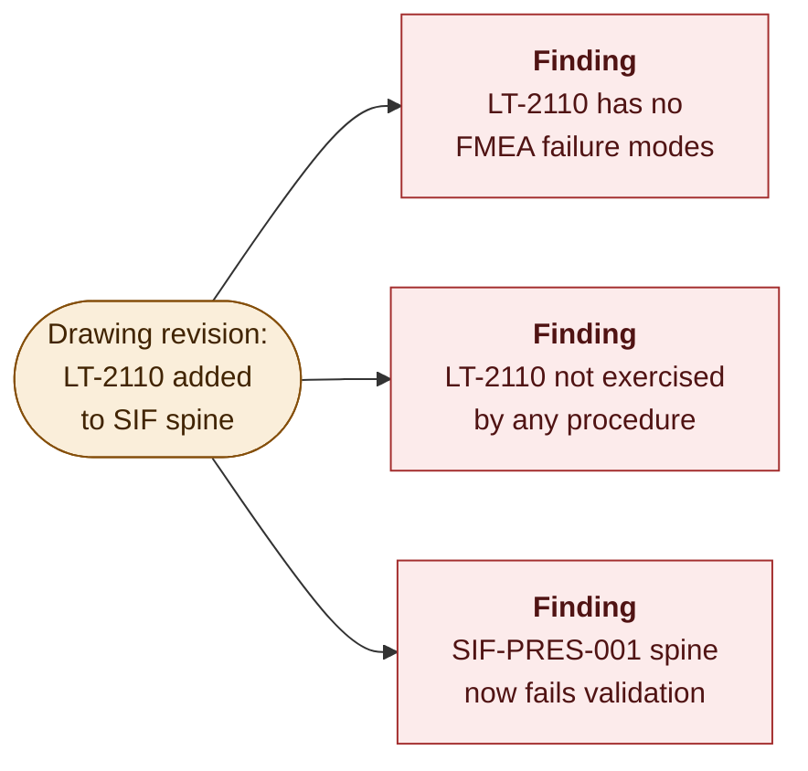
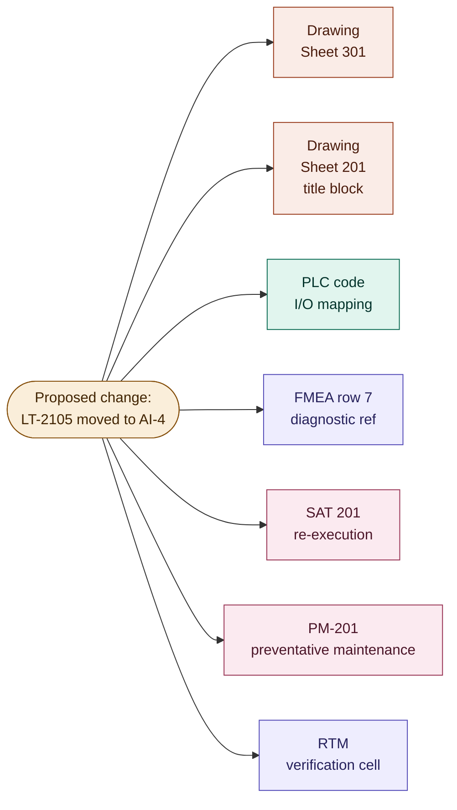
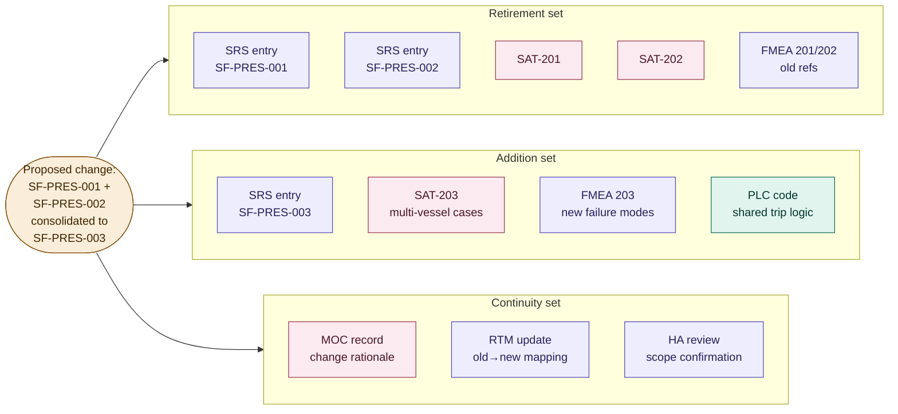

# Engineering Knowledge Graph (EKG)

**Status:** Concept document

---

## 1. Problem Statement

The artifacts of an industrial control system (drawings, PLC code, P&IDs, I/O lists, FMEA, functional requirements, SRS, hazard analysis, FAT/SAT, preventative maintenance procedures) encode interrelated information about a single system. References to a given device, signal, requirement, or hazard appear in multiple artifacts, in inconsistent formats, with no shared structural index. Maintaining consistency between these artifacts is currently performed manually by experienced engineers, against documentation sets that change continuously through revision and management of change. Coverage gaps, traceability breaks, and revision drift accumulate silently and are typically detected at audit, at commissioning, or following an incident. The problem is most acute for safety instrumented systems, where standards mandate explicit traceability and the cost of gaps is highest, but the same structural problem applies to functional verification, constraint compliance, and any engineering activity with a network of cross-artifact obligations.

The cost of scattered documentation is felt most sharply at the end of a project, when SAT writing, systems changes, and documentation closeout converge under a compressed timeline. Writing a SAT is not difficult in itself. The difficulty is that the information needed to write it is distributed across five or more documents that do not reference each other in a navigable way. The engineer works with the FMEA in one window, the drawing in another, the SRS in a third, reconstructing which device gets which failure injected, what the expected reaction is, and whether the drawing being referenced is even current. Tools exist to streamline SAT formatting and templating, but they address the writing workflow, not the information gathering problem upstream of it. Meanwhile the drawings are still revising, the FMEA is still receiving new entries as commissioning reveals gaps, and the SRS may have changed based on field conditions. The engineer is writing SATs against a moving target, with no way to confirm that the information being written from is current and consistent across the full document set. This is not a tooling problem. It is a structural problem: the connections between artifacts exist only in the engineer's head, and the pressure to produce deliverables arrives at exactly the moment when those connections are changing fastest.

## 2. Why a Graph

A graph in the computer science sense is a set of items (nodes) connected by relationships (edges), where both the items and the relationships can carry types. Common examples: a road network is a graph of intersections connected by roads, where routing means finding a path through it; the web is a graph of pages connected by hyperlinks, where reachability means whether one page can be reached from another by following links. The operations of interest are traversal (following edges from one node to another) and reachability (whether a path of certain edge types exists between two nodes). EKG uses these operations across the documentation set, with each artifact's contents contributing nodes and edges to one connected structure.

An engineering verification effort is a network of obligations. Hazards obligate mitigations. Mitigations obligate verifications. Functional requirements obligate functional tests. FMEA failure modes obligate system reactions. System reactions obligate tests. Tests obligate exercised devices. Constraints obligate compliance evidence. Each obligation is structural: not "should probably be checked" but "the schema requires this relationship to exist or the verification claim is incomplete." The work of engineering verification is, in substantial part, the work of discharging these obligations and demonstrating that they have been discharged. Safety cases are the densest and most rigorous instance, but the structure generalizes.

Three properties of the obligation network distinguish it from simpler bookkeeping problems and rule out the data structures that would otherwise be sufficient.

The obligations cross between artifact types. A hazard lives in the HA. The SIF (safety instrumented function) that mitigates it lives in the SRS. The procedure that verifies the SIF is its own document. The device that the procedure exercises is in the drawings. The code that reads the device is in the PLC source. Five different artifacts, five different formats, authored by different people at different times, but a single obligation chain runs through all of them. A spreadsheet can record that the chain exists; it cannot navigate from one artifact to the next, follow the chain, and identify where it breaks.

The obligations are dense and overlapping. A single device participates in multiple SIFs. A single reaction is verified by multiple SATs because multiple failure modes converge on it. A single FMEA failure mode produces a system reaction that is tested by SATs, addressed by preventative maintenance procedures, detected by code diagnostics, and wired to specific devices. The cross-references are many-to-many. A linear traceability matrix flattens this into rows and columns and loses the relational structure that makes cross-cutting queries possible.

The obligations are not static. Drawings revise. Code revises. FMEAs revise. Procedures revise. Each revision changes which obligations are still discharged and which are now open. The diff between states is the set of new findings: what just broke, what just got covered, what is now incomplete that was complete yesterday. A spreadsheet must be re-walked manually to find these; a graph computes them as a query.

The graph is what is left when the data structure is required to match the structure of the work: cross-artifact navigation through typed obligation chains, many-to-many overlap with structural justification, and continuous re-evaluation as the underlying artifacts change. Tables are flat. Documents do not compose. Narrative is ambiguous. None of these support all three properties simultaneously. The graph does.

A second-order consequence follows from the structural choice. Once the graph is the model, the safety-case deliverables become projections of graph state rather than separately maintained documents. The traceability matrix is a query. The blast-radius analysis is a query. The coverage report is a query. Each is deterministic and carries its provenance back to specific edges and specific source documents. Fixes applied to the graph propagate to every projection that depends on them, which is the property that makes documentation drift reversible.

## 3. Proposed System

EKG (Engineering Knowledge Graph) is a proposed system of record that would represent the cross-artifact relationships of an engineering verification effort as a typed graph and operate on that graph to detect inconsistencies, generate derived deliverables, and propagate corrections. The application that drives the design is safety case management, where obligations are densest and standards mandate explicit traceability, but the schema and operations apply equally to functional verification and constraint compliance.

EKG will ingest authored artifacts from their source tools (CAD, IEC 61131-3 PLC sources, document files, spreadsheets) and construct graph fragments with provenance. The graph will support queries that correspond to standards-mandated traceability claims (IEC 61511, IEC 61508, ISO 13849, IEC 62061).

## 4. Conceptual Model

EKG will model the verification effort as four conceptual graph layers over a shared entity layer.

**Figure 1.** The four-layer conceptual model.

- **Justification graph.** Hazards, requirements, safety functions, FMEA failure modes, integrity targets, standards clauses. Source artifacts: HA (hazard analysis), SRS (safety requirements specification), FMEA (failure modes and effects analysis), standards library.
- **Logical graph.** Routines, statements, conditions, signals read and written, system states established and cleared. Source artifacts: PLC source files, HMI definitions.
- **System graph.** Devices, terminals, wires, cables, panels, drawing sheets, loops. Source artifacts: wiring diagrams, P&IDs, loop sheets, I/O lists, panel layouts.
- **Procedural graph.** Procedures, the steps that compose them, ordering and prerequisite relationships, evidence records, signoff blocks, step templates. The procedure is the verification unit; individual steps are constituents. Source artifacts: FAT (factory acceptance test), SAT (site acceptance test), LOTO (lockout/tagout), calibration, preventative maintenance procedures.
- **Shared entity layer.** Tags, devices, signals, terminals, system states, setpoints. Cross-artifact references resolve to these nodes via tag normalization.

The four layers are stored as a single graph with typed nodes and edges. Node and edge types are constrained by a schema that mirrors the standards' traceability requirements.

## 5. Ingestion

The artifacts that constitute an industrial control system's documentation set are not unstructured prose. They are tabular, keyed, and cross-referenced by design, because the standards and engineering practices that produce them demand it.

The hazard analysis is a table. Each row is keyed by a hazard identifier. Columns carry the hazard description, the consequence, the risk ranking, and the mitigation reference, typically a SIF or procedural control specified in the SRS. The FMEA is structured the same way: each row is keyed by a failure-mode identifier, with columns for the equipment tag (drawn from the drawing package), the failure effect, the system reaction, the detection method, and the SRS or SAT reference that addresses it. The SRS is a list of requirements and calculations, each referencing the actual equipment used in the design by the tags assigned in the drawings. The drawings themselves, whether drafted to NFPA or IEC conventions, are highly structured: device designations, terminal identifiers, wire numbers, and signal references follow defined schemas. Every other document in the set (FATs, SATs, validation matrices, preventative maintenance procedures) references back to these artifacts using the same tag vocabulary.

This means the primary ingestion path is deterministic parsing of structured data: reading keyed rows from tables, resolving tag references against the drawing package, and following explicit cross-references between documents. The graph fragments produced by ingestion carry provenance to the source artifact, row, and cell. Where artifacts contain free-text fields (notes columns in an FMEA, narrative descriptions in a hazard analysis), an LLM may assist in extracting structured content, but this is at the margins. The core of the ingestion pipeline operates on data that is already organized for exactly the kind of cross-referencing EKG formalizes.

Ingestion is not a one-time event. As a project progresses, artifacts revise: drawings update, FMEA rows are added, PLC code changes, procedures are rewritten. Each time a revised artifact is re-ingested, the parser produces a new set of graph fragments from that artifact. The difference between the previous graph state and the new one is a structured diff: nodes added, nodes removed, edges added, edges broken, edge validity changed. This diff is what makes it possible to ask "what did this revision break?" and "what does this proposed change affect?" The cascade and blast-radius operations described in section 8 are both computed from the diff that ingestion produces.

## 6. Cross-Layer Edges

Cross-layer edges encode the standards-mandated relationships between artifact contents. Examples:

- `mitigated_by` (justification → justification): an HA Entry's measure is implemented by an SRS Entry. (ISO 12100 §6.3 risk reduction.)
- `verified_by` (justification → procedural): an SRS Entry is verified by a SAT. (ISO 13849-1:2015 §8 validation.)
- `implemented_by` (justification → shared): an SRS Entry's subsystem chain references the input, logic, and output devices that realise the safety function. (ISO 13849-1:2015 §4.5.)
- `references_device` (justification → shared): an FMEA Entry analyses a specific device.
- `tested_by` (justification → procedural): an FMEA Entry's Tests column references the SATs that address its failure mode. (ISO 13849-2:2012 fault list validation.)
- `addresses` (procedural → justification): inverse of `tested_by`; a SAT addresses an FMEA Entry.
- `exercises_device` (procedural → shared): a SAT exercises a device named in its `reference_designator` field.
- `reads_tag`, `writes_tag` (logical → shared): a routine reads or writes a signal. (IEC 61131-3.)
- `mapped_to` (shared → shared): a PLC tag is mapped to a device's terminal.
- `shown_on`, `contained_in`, `connected_to` (system → system): a device appears on a drawing sheet, sits inside a panel, or is connected to another device. (IEC 81346-2 reference designation.)

A SIF spine is the set of devices, wiring, and logic that together implement a single safety instrumented function. It is the physical and logical path from the field sensor through the logic solver to the final element. Every device on the spine participates in the safety function, and every device on the spine must be individually verified.

Figure 2 shows one safety function's connections across all four layers via a single shared device.

**Figure 2.** Cross-layer connections for one safety function through a single shared device.

### 6.1 What the Graph View Provides

Representing the verification effort as a typed graph, rather than as a list of documents and a mental model held in the heads of experienced engineers, gives the engineer queries and structural checks that are otherwise expensive or impractical to perform. The underlying mechanism is described in section 7: depth-first traversal that walks only valid nodes and edges, halting where validity fails. The point where the traversal stops is the finding. Three capabilities are worth naming concretely.

#### Redundancy Detection

When multiple SATs target the same device with similar fault-injection descriptions, the graph surfaces them for engineer review. The query is a candidate-finder, not a deterministic matcher: it groups SATs by `reference_designator.id` and surfaces groups whose `induced_fault` text overlaps. Identical descriptive prose can still hide different terminals or conductors, and different prose can describe the same physical action — so the engineer's judgment closes each case. Do the tests perform the same physical fault injection (consolidate into one SAT covering multiple failure modes), or do they exercise different actions on the same device that happened to be worded similarly (differentiate the descriptions)?

Without the graph, the question doesn't get asked at the test-list level: each SAT looks complete on its own with its own FMEA reference, and the convergence opportunities go unsurfaced.

**Figure 3.** Convergence candidate: four SATs targeting the same device with overlapping fault-injection text, flagged for engineer review.

In Figure 3, four FMEA failure modes for a 24V power supply (PSU failure, wire break, wire short, PLC input failure) are each addressed by their own SAT. All four SATs name the same device and use the same `induced_fault` text — at face value, the same physical action. The graph flags the group; the engineer evaluates. If pulling the same wire genuinely tests all four failure modes, the four SATs consolidate into one. If the failure modes require different fault-injection methods (different wires, different mechanisms) that were worded similarly by writing convention, the engineer rewrites the descriptions to make the actions structurally distinct and the SATs stay separate. The graph surfaces the question; the engineer answers it. The same candidate-finder pattern applies to distributed E-stop stations sharing stop-button-press text, transmitter loops sharing wire-short text, and signal paths feeding shared trip outputs.

#### Coverage Gap Detection

Coverage gap detection is a traversal that starts at a justification-layer node and attempts to reach the procedural layer along the required edge pattern. At each node along the way, the node's validation rules are evaluated (section 7.3). If a node fails its own rules (a missing edge, a broken equipment reference, a format violation), the traversal halts there, and the failing rule is the finding. If the traversal reaches the procedural layer with every node and edge valid along the way, the obligation chain is complete.

Some nodes generate their own required-edge sets from their architectural attributes. A permissive bit's precondition list determines its required SAT family; a voting architecture determines the required input-output relationships; a composite reaction's sub-behavior list determines the required verification steps within its covering SAT. These are validation rules on the node: the node's specification says what edges should exist, and the rule checks whether they do. An engineer asking "what hasn't been tested yet" gets a query result: the set of nodes where traversal halted.

**Figure 4.** Coverage of a permissive bit through composition: each input path verified by its own SAT, the bit-forced SAT verifying the output side.

Figure 4 shows the dispatch-allowed bit on a ride system. The bit is high only when every precondition is satisfied (restraints locked, gates closed, no E-stop active, ride in ready state, operator key engaged) and the bit gates the dispatch action. The graph generates the required SAT set from the bit's precondition list: one SAT per precondition (verifying that disturbing it drops the bit) plus a bit-forced SAT (verifying that the dropped bit blocks dispatch). N preconditions yield at minimum N+1 required SATs, and the graph confirms each requirement has a covering test. A missing precondition SAT shows up immediately as a validation finding. So does the case where every precondition SAT is authored but no bit-forced SAT exists, the input-side verification is complete, the output-side is not, and the composition argument is broken. The schema flags it before the verification effort is signed off, not at audit.

#### Composition Queries

The same traversal mechanism lets the engineer ask the question that's hard to ask without a graph: how many ways does this state get triggered, and how many of them are verified? The query runs in either direction. On the input side it asks how many paths set or clear a bit, where each path is a separate traversal, and each must reach a valid SAT. On the output side, for a reaction that decomposes into sub-behaviors with their own intermediate observables, it asks how many of the reaction's constituent observations have valid traversal paths to covering tests. The engineer gets an authoritative answer to a question that previously required walking through the test plan, the FMEA, and the design specs in parallel.

The patterns shown so far, action redundancy and intermediate-state composition (input-side and output-side), are illustrative rather than exhaustive. Real verification efforts contain many more structural patterns: bypass and override paths, latched-state recovery sequences, mode-dependent enabling conditions, time-windowed behaviors, alarm hierarchies, sequence interlocks. Each has its own characteristic shape in the graph and its own node validation rules. The framework handles them all the same way (typed nodes and edges, propositional validation rules per node type, depth-first traversal that halts on invalidity), and the reader who has followed the patterns above should be able to recognize the shape of additional patterns when they encounter them in their own work.

## 7. Traversal, Validity, and Goal Structuring Notation

### 7.1 The Algorithm Is Depth-First Search

The operations described in section 6.1 (coverage gap detection, redundancy detection, composition queries) and the operations described in section 8 (blast radius, cascade, traceability generation) are all instances of the same underlying algorithm: depth-first search over typed edges.

The traversal walks only valid nodes and edges. At each node it visits, the node evaluates its own validation rules (section 7.3). At each edge it crosses, the edge evaluates its own validity predicate (section 7.2). If a node fails any of its rules, or an edge is invalid, the traversal stops there. The point where the traversal halts is the finding.

End-to-end validation of a verification claim means being able to traverse the graph from the justification-layer origin (a hazard, a failure mode, a safety function) all the way to the procedural-layer evidence (a SAT, a preventative maintenance procedure) on a path of exclusively valid nodes and edges. If the traversal completes, the claim is structurally supported. If it cannot complete, the claim is broken, and the engineer knows exactly where, because the traversal stopped at the node or edge that failed.

Two complementary validation mechanisms produce findings, and they are not interchangeable. **Node rule violations** (§7.3) are how the schema catches *missing required structure* — a rule on a node says "must have at least one `tested_by` edge" or "PL Achieved must meet PLr (ISO 13849-1:2015 §4.5.4)" or "post-measure risk level must be lower than initial risk level (ISO 12100 §6.3)," and a rule fails. Required edges that don't exist surface here, on the node whose rule required them. **Edge validity drift** (§7.2) is how the schema catches *existing edges that have gone stale* — a `verified_by` edge from an SRS Entry to a SAT was valid yesterday; today the SAT has been revised and no longer references the SRS Entry in its scope, so the edge's validity predicate now returns false. Together, the two mechanisms give the engineer a structurally complete picture: what the schema requires that isn't there (node rules), and what was there but is no longer current (edge validity).

Coverage gap detection starts at a hazard node and walks depth-first along the typed edge pattern `mitigated_by → verified_by → exercises_device`. If a node along that path fails its validation rules (the SRS Entry has no `verified_by` edge, or the SAT references a device that doesn't exist on a current drawing), the traversal halts and that failure is the finding. The FMEA chain works identically: start at an FMEA Entry, follow its `tested_by` edge to a SAT, and halt on the first invalidity. Blast radius is depth-first search from a changed node, following all outgoing cross-layer edges, collecting every reachable node. Cascade is the same traversal triggered by the diff that ingestion produces.

Redundancy detection is the one case that works in the opposite direction: not a traversal from a starting node but a group-by query over SAT properties. Multiple SATs that share a `reference_designator` (Device) with overlapping `induced_fault` text converge on the same physical fault injection. The query groups SAT nodes by `(reference_designator.id, induced_fault)` and surfaces the groups for engineer review (§6.1).

### 7.2 Edge Validity

Every edge has a binary state: valid or invalid. The state is computed from the current revision status of the artifacts the edge depends on. A `verified_by` edge from a requirement to a procedure is valid only if the requirement is current, the procedure has been ingested at its current revision, and the requirement is referenced in the procedure's verification scope with provenance. An invalid edge halts traversal just as an invalid node does. The traversal cannot cross it, and the edge becomes the finding. Edge validity catches drift: relationships that were valid and broke as artifacts revised.

Figure 5 shows the two obligation chains side by side, with two valid examples and two invalidities. On the hazard chain, HA-PRES-001 is mitigated by safety function SF-PRES-001 which is verified by a SAT — a complete path. On the FMEA chain, failure mode FM-LT2105-FAULT has a documented system reaction (process trip to safe state) and is tested by a SAT that addresses the failure mode — also complete. The two invalidities are both **node rule violations**: HA-TEMP-001 has no `mitigated_by` edge (HA Entry rule fails); FM-PT3201-DRIFT has no `tested_by` edge (FMEA-safety-subtype rule fails). Both findings sit on the node whose rule required the edge, not on a stale edge — neither path ever existed.

**Figure 5.** Hazard chain and FMEA chain validity, showing valid and invalid examples side by side.

Figure 6 shows a single edge transitioning from valid to invalid as a result of a drawing revision, breaking the path that depends on it.

**Figure 6.** Edge validity changing on drawing revision.

### 7.3 Node Self-Validation

Every node in the graph has a type, and every type carries validation rules. A node is valid when all of its type's rules evaluate to true against the node's current edges, attributes, and the validity of its referenced nodes. The rules are propositional: each one is a statement that is either true or false given the current graph state, and they compose: a node with five rules is valid only when all five are satisfied.

A SAT node illustrates how these rules build up. At minimum, a SAT must reference at least one justification-layer node — an FMEA Entry, an SRS Entry, or a functional requirement. That is the first rule. If the SAT addresses an FMEA Entry of safety subtype, a second rule applies: the SAT must conform to the canonical fault test lifecycle for its (fault_class, reaction_class) combination — verification of normal state, fault induction, verification of the safe state, attempted reset and restart while faulted, fault removal, and verification of return to normal. The lifecycle's exact step count varies with the combination (the persistent-fault-to-safe-state procedure is 22 steps; transient-fault variants add steps to verify the system stays latched after the fault clears). A third rule checks the SAT's equipment references: the `reference_designator` must resolve to a valid Device node, and every PLC tag named in `system_reaction_tags` and `monitored_tags` must resolve to a valid Tag node in the shared layer.

The rules for a SAT node, then, are:

- The SAT must reference at least one justification-layer node — FMEA Entry, SRS Entry, or functional requirement. (ISO 13849-1:2015 §8; ISO 13849-2:2012.)
- If the SAT addresses a safety-subtype FMEA Entry, it must conform to the canonical fault test lifecycle template for its (fault_class, reaction_class) combination. (ISO 13849-2:2012.)
- The `reference_designator` must resolve to a valid Device node.
- Every PLC tag named in `system_reaction_tags` and `monitored_tags` must resolve to a valid Tag node.
- The `induced_fault` must be non-empty for FMEA-driven SATs.
- The `hmi_message` must match the alarm config entry referenced in the SAT's verify-alarm step.

Each rule is independently evaluable and each produces a true/false result. The SAT node is valid when the conjunction of all its rules is true. A rule that fails is a finding, and the finding carries the specific rule that failed, so the engineer knows whether the problem is a missing justification reference, a procedure-template violation, a broken device or tag reference, or an HMI-message inconsistency.

Other node types carry their own rule sets, and the same pattern of conditional rules applies. A hazard node must have a `mitigated_by` edge. That is the first rule. But the type of mitigation determines what further obligations follow. If the mitigation is a safety instrumented function, the hazard must also trace to an SRS entry specifying the function and to SATs verifying it. If the mitigation is a procedural control, the hazard must trace to the procedure that implements it. A mechanical safeguard may require only a design reference. The hazard node's rule set branches on mitigation type: the first rule is unconditional, the subsequent rules are conditional on what the first rule found. A device node must appear on a current drawing and must have at least one FMEA failure mode documented. An FMEA failure-mode node must have a populated `system_reaction` property and either a detection method or a preventative maintenance procedure. The rules are specific to each type but the evaluation machinery is the same: enumerate the rules, evaluate each against current graph state, report any that fail.

This is where the system's complexity lives, and where it scales. Adding a new validation rule to a node type is adding a new propositional check, not rewriting an algorithm. The rule set for a given node type can start simple and grow as the engineering team's understanding of what constitutes completeness deepens. A first implementation might check only that required edges exist. A later iteration might check that referenced documents are at current revision, that tag formats conform to project naming conventions, or that SIL ratings are consistent between the SRS entry and the SAT that verifies it. Each addition is a new rule on a node type, evaluated the same way as every other rule.

### 7.4 Goal Structuring Notation and the Justification Layer

Goal Structuring Notation (GSN) is a graphical notation developed at the University of York in the 1990s for presenting safety arguments as directed graphs. A GSN diagram connects top-level safety claims (goals) to sub-goals, strategies, contexts, assumptions, and evidence nodes. The notation is standardized and widely used in railway, automotive, nuclear, and aerospace safety cases. It is the established way to express the *argument* that a system is safe: the reasoning structure that connects a top-level claim ("the system is acceptably safe") through intermediate claims to the evidence that supports them.

EKG's justification layer (hazards, requirements, safety functions, FMEA failure modes, integrity targets) is modeling the same territory that GSN addresses, but from the artifact side rather than the argument side. GSN says: here is the argument structure that justifies the safety claim. EKG says: here is whether the evidence that argument depends on actually exists, is current, and is structurally complete. The two are complementary. A GSN goal node that claims "SIF-PRES-001 is verified" is supported by evidence that a SAT exists and has passed. EKG's traversal from the SIF node to the SAT node along `verified_by` edges is the structural check that confirms or denies whether that evidence is present.

EKG's justification layer should adopt GSN as the notation for its argument structure. The hazard and FMEA chains described above, and the obligation relationships between them, map naturally to GSN goal decomposition. Hazard nodes become top-level goals. Mitigation nodes become sub-goals. Verification nodes become evidence references. The validation rules that EKG evaluates at each node correspond to GSN's requirement that every goal be supported: a goal with no supporting evidence or sub-goal is an undischarged obligation in both frameworks. Adopting GSN gives the justification layer an established notation that auditors and safety assessors already understand, and it gives GSN practitioners a system that can automatically check whether the argument structure they have drawn is backed by current, complete evidence in the underlying artifacts.

## 8. Supported Operations

The following operations are derived from the traversal and node self-validation machinery described in section 7:

- **Coverage analysis.** Traverse from each justification-layer node toward the procedural layer. Nodes where traversal halts (because a validation rule fails or a required edge is missing) are the coverage gaps: hazards without mitigations, mitigations without verifications, FMEA failure modes without system reactions, system reactions without tests, devices not exercised by any procedure.
- **Cross-artifact consistency checking.** Identify references in one artifact (e.g., a tag in a SAT step) that do not resolve to current-revision content in another (e.g., the corresponding drawing).
- **Traceability matrix generation.** Render the standards-required traceability matrix as a query over current graph state rather than as a maintained document.
- **Blast radius analysis.** Given a proposed or executed change to an artifact, enumerate the set of all artifacts transitively affected through cross-layer edges.
- **Derived deliverable generation.** Produce SATs, preventative maintenance procedures, traceability matrices, and coverage reports as deterministic functions of current graph state.
- **Alarm configuration generation.** Produce platform-specific alarm documents from the same FMEA and device data that drives the SATs. Each alarm entry carries the device tag, the alarm message, the severity, the triggering condition from the FMEA's detection method, and the expected system reaction. Today, alarm configurations are maintained as a separate document, authored by hand, cross-referenced to the FMEA and the SATs manually. When an FMEA entry changes, the alarm document must be updated independently, and so must the SAT that verifies the alarm is displayed. Three separate documents maintained in parallel, describing the same information, with no structural guarantee that they agree. The graph eliminates this: the FMEA node, the alarm message, and the SAT that checks for it are all projections of the same data. A change to the failure mode or detection method propagates to both the alarm configuration and the SAT, because both are generated from the same graph state.
- **Causal walk-back.** Given a system reaction (e.g., a final element actuating), walk backward through the logical and shared layers to enumerate the causal contributors and their physical origins.
- **Cascade on revision.** When source artifacts revise, recompute affected node and edge validities and surface the differences as findings.

### 8.1 Cascade on Revision

The cascade operation will be the mechanism by which node and edge validation becomes continuous rather than episodic. Each ingest produces a new graph state; the diff against the previous state identifies which nodes and edges have changed. The validation rules on those nodes are re-evaluated, and any node that now fails a rule it previously passed, or any traversal path that is now blocked where it previously completed, is a new finding. Three representative cases:

*A new device appears in a drawing revision.* The drawing parser will discover a device node that did not exist in the previous graph state. Once the node is added to the shared entity layer, its validation rules will run against it. The device has no incoming `references_device` edges from any FMEA Entry (no documented failure modes), no incoming `exercises_device` edges from any SAT (untested), and if an SRS Entry's subsystem chain has named it via `implemented_by`, that SRS Entry now fails its own validation because one of its devices is unverified. A single drawing change will produce multiple findings, each pointing at a different unfilled obligation.

*A device designation changes.* The drawing parser will see a new identifier (e.g., LT-2105 to LT-2105A). The tag normalizer will collapse common aliases (whitespace, hyphenation, case) but a deliberate redesignation is a real identity change and will produce a new node. The old node loses its drawing-side anchor (its `shown_on` edges no longer point to any current drawing sheet), and any artifact still referencing the old name (PLC code, FMEA, SAT) now points at a node that fails its own validation rules. The new node fails because nothing else has caught up to it. Findings surface as "tag LT-2105 in PLC code does not resolve to a current device" and "device LT-2105A has no FMEA, no procedure, no code references."

*Logic or tag references change.* The PLC source parser will discover new `reads_tag` or `writes_tag` edges, or find that previous edges no longer exist. If a safety function's trip logic references a tag that was not previously on the subsystem chain, validation rules will run against that tag: is there a SAT exercising the device the tag is mapped to, are there FMEA Entries referencing that device, is the device on a current drawing. Each missing edge is a finding.

All three cases should be handled by the same mechanism. There should be no special-case logic for "device added" vs. "tag renamed" vs. "logic changed"; each is a difference between two graph states, and the validity checks will fire on whatever nodes and edges the diff touches.

Figure 7 shows the new-device case. Before the drawing revision, the graph contains the existing SIF spine. After ingest, LT-2110 is a new node; its validation rules will produce three findings simultaneously.

**Figure 7.** Cascade findings produced when a new device appears in a drawing revision.

#### Replacement vs. Addition

A device added to a SIF spine and a device that *replaces* an existing device in a SIF spine produce the same shape of diff at the node level (one node added, possibly one node removed) but represent operationally different situations. A like-for-like replacement of LT-2105 with LT-2105B in the same vote role does not change the spine's structure; the role and its failure modes are already documented, and the engineering work is to rebind existing FMEA, procedure, and code references from the old device to the new one. The SIF's validation was satisfied before the replacement and remains satisfied after, provided the rebindings are made. Re-validation may not be required at all if the replacement is identical in function and calibration.

For EKG to distinguish replacement from addition, the schema must model SIF spines at the level of *roles* (vote-input positions, final-element positions, reset paths) and treat devices as instances bound to those roles. A change that preserves the role binding but changes the device instance is a replacement; a change that creates a new role with no prior occupant is an addition. The cascade operation should classify findings accordingly: a replacement will produce a single rebind finding ("primary vote role: LT-2105 replaced by LT-2105B; rebind FMEA, procedure, code references"); an addition will produce the structural-gap findings shown in Figure 7. EKG will present the classified change.

### 8.2 Late-Stage Change Management

The case where the cost of incomplete cross-artifact knowledge is highest is late-stage change: a change discovered at FAT, commissioning, PSSR, or after process introduction. By that point the artifact set is large, the cross-references have been built up over many revisions, and the engineering pressure is to ship. A change that an experienced engineer would handle correctly with three weeks of careful review must instead be handled in three days under schedule pressure, often by someone who wasn't present when the original references were authored. Missed downstream artifacts at this stage produce deviations at FAT, findings at PSSR, unplanned outages at startup, or, worst case, quiet inconsistencies in the safety case that surface only after an incident.

The blast-radius operation is the prospective counterpart to cascade: given a *proposed* change rather than an ingested one, the same edge traversals enumerate the artifacts that would be affected if the change were made. The structural answer it provides scales across the change types that show up in late-stage work.

**Device removal or relocation.** The simplest case. A device is removed or its identity changes (re-tagged, moved to a different I/O channel). Blast radius enumerates every artifact that references the device through any cross-layer edge: drawings showing the device, PLC code reading or writing its tag, FMEA entries naming it, SATs exercising it, PSSR checklist items referencing it, traceability matrix cells citing it. Figure 8 shows the case for a single I/O channel change.

**Figure 8.** Blast radius of a single I/O channel change.

**Feature addition.** A feature gap is discovered at commissioning, for example a missing alarm condition or a missing interlock. Adding a feature is structurally a small new justification chain: a new requirement (or a revision to an existing one), a new behavior in the logic, possibly a new device or a new use of an existing device, a new SAT verifying the new input-output relationship. Blast radius is less about *what existing artifacts are affected* and more about *what new artifacts must be authored to discharge the new obligations the feature creates*. The node self-validation machinery from section 7.3 handles this directly: the new requirement node fails its validation rules (no `verified_by` edge) until the SAT is authored. The new SAT fails its own rules (no `addresses` edge to an FMEA Entry) until the FMEA Entry is authored with its `system_reaction` property populated. The traversal from the new requirement cannot complete until every node along its path passes. The graph forces the new feature to be fully justified before it appears as complete.

**Feature consolidation and extension.** The hardest case. Two existing features are consolidated into one with extended scope, for example two separate high-pressure trips (one per vessel) consolidated into a single multi-vessel trip with shared logic, or a manual reset feature extended to include automatic reset under specific conditions. Consolidation is simultaneously a retirement and an addition: the old references must be retired without leaving orphan justifications, the new references must be added with full justification, and the relationship between old and new must be explicit so reviewers can trace what changed and why. Blast radius for consolidation has three components: the retirement set (artifacts referencing the old features that need updating to point at the consolidated feature), the addition set (new artifacts required for the extended scope), and the continuity set (artifacts that must explicitly document the consolidation as a change rather than silently absorbing it). Figure 9 shows the structure.

**Figure 9.** Blast radius of a feature consolidation: retirement, addition, and continuity sets.

The retirement set is found by traversal from the old feature nodes. Every artifact with an edge to SF-PRES-001 or SF-PRES-002 needs review. The addition set is found by running validation rules on the new feature node. Every required relationship that doesn't yet exist is a finding. The continuity set is the harder one structurally: it requires the schema to know that consolidation is a *named change type* with its own required artifacts (MOC (management of change) documentation, traceability mapping, hazard analysis review) rather than just a sequence of additions and deletions. The schema can model this with a `consolidation` node type linking the old and new feature nodes, with required edges to MOC, RTM (requirements traceability matrix), and HA artifacts; the consolidation node's validation rules then surface any consolidation that lacks its required continuity artifacts.

In all three change types, the value is the same: instead of an experienced engineer trying to reconstruct the cross-reference set from memory under schedule pressure, blast radius produces it as a query result. The change can be executed with confidence that the affected artifact set is complete.
